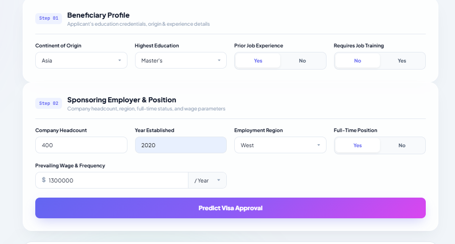
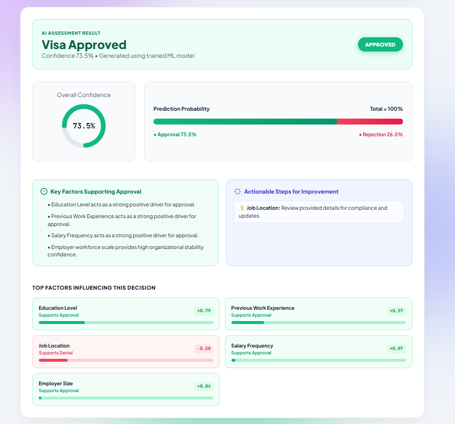

<div align="center">

# 🇺🇸 US Visa Petition Approval Prediction & Explainability System

### AI-Powered Decision Intelligence for H-1B / Work Visa Certification

<p>
  
  
  
  
  
  
</p>

**A production-grade, end-to-end machine learning system** that predicts whether a US H-1B / permanent work visa petition will be **Certified (Approved)** or **Denied**, based on beneficiary qualifications and employer metrics.

*Modular MLOps pipeline &nbsp;•&nbsp; SHAP-driven explainability &nbsp;•&nbsp; FastAPI backend &nbsp;•&nbsp; Glassmorphism UI*

</div>

---

<div align="center">

## 📖 Table of Contents

</div>

<div align="center">

[Key Features](#-key-features) &nbsp;•&nbsp;
[Screenshots](#-system-screenshots) &nbsp;•&nbsp;
[Tech Stack](#-tech-stack--mlops) &nbsp;•&nbsp;
[Architecture](#-end-to-end-architecture) &nbsp;•&nbsp;
[Project Structure](#-project-structure)
<br/>
[Getting Started](#-getting-started) &nbsp;•&nbsp;
[API Usage](#-api-usage) &nbsp;•&nbsp;
[Model Details](#-model-details) &nbsp;•&nbsp;
[Roadmap](#-roadmap) &nbsp;•&nbsp;
[Contributing](#-contributing) &nbsp;•&nbsp;
[License](#-license)

</div>

---

<h2 align="center">🚀 Key Features</h2>

<table>
  <tr>
    <td width="50%" valign="top">
      <b>🧩 End-to-End Modular Pipeline</b><br/>
      Built following production architecture conventions (<code>components</code>, <code>pipeline</code>, <code>entity</code>, <code>utils</code>).
    </td>
    <td width="50%" valign="top">
      <b>⚖️ Smart Class Imbalance Handling</b><br/>
      Intrinsic, cost-sensitive weighting (<code>auto_class_weights="Balanced"</code>) instead of artificial oversampling, preserving true data distribution.
    </td>
  </tr>
  <tr>
    <td width="50%" valign="top">
      <b>🔍 Explainable AI (XAI)</b><br/>
      Integrates SHAP's <code>TreeExplainer</code> to attribute every prediction to its underlying feature contributions.
    </td>
    <td width="50%" valign="top">
      <b>🎯 Smart Threshold Tuning</b><br/>
      Optimizes the classification cutoff for F1-score rather than defaulting to a naive 0.5 threshold.
    </td>
  </tr>
  <tr>
    <td width="50%" valign="top">
      <b>💎 Interactive Glassmorphism UI</b><br/>
      Responsive interface with SVG progress rings and color-coded impact gauges.
    </td>
    <td width="50%" valign="top">
      <b>⚡ Async RESTful API</b><br/>
      FastAPI backend with built-in Pydantic request/response validation.
    </td>
  </tr>
  <tr>
    <td colspan="2" align="center">
      <b>📈 Full Experiment Tracking</b><br/>
      Complete run history, metrics, and artifacts logged to MLflow and synced to DagsHub.
    </td>
  </tr>
</table>

---

<h2 align="center">📸 System Screenshots</h2>

<div align="center">

<table>
  <tr>
    <td align="center" width="50%">
      
      <br/>
      <sub>🧾 <b>Interactive Form Input</b></sub>
      <br/>
      <sub>User enters applicant credentials, employer scale & position details</sub>
    </td>
    <td align="center" width="50%">
      
      <br/>
      <sub>🤖 <b>AI Assessment & SHAP Output</b></sub>
      <br/>
      <sub>Approval probability, confidence score & top SHAP impact factors</sub>
    </td>
  </tr>
</table>

</div>

> 💡 Place your screenshots in `./Screenshots/` as `input.png` and `output.png` to render this section correctly.

---

<h2 align="center">🛠️ Tech Stack & MLOps</h2>

| Layer | Technologies Used |
| :--- | :--- |
| **Machine Learning** | Python, Scikit-Learn, CatBoost, XGBoost, Random Forest, Gradient Boosting |
| **Explainable AI** | SHAP (SHapley Additive exPlanations) |
| **Preprocessing** | ColumnTransformer, PowerTransformer (Yeo-Johnson), OneHotEncoder, StandardScaler |
| **Backend Framework** | FastAPI, Uvicorn, Pydantic |
| **Frontend** | HTML5, Custom CSS3 (Glassmorphism), Vanilla JS (Async Fetch) |
| **Tracking & Logging** | MLflow, DagsHub, custom logging & exception handlers |
| **Data Drift Monitoring** | Evidently AI |

---

<h2 align="center">📊 End-to-End Architecture</h2>

```text
                ┌────────────────────────┐
                │   User Web Input / UI  │
                └───────────┬────────────┘
                             │
                             ▼
                ┌────────────────────────┐
                │   FastAPI Endpoints    │
                └───────────┬────────────┘
                             │
                             ▼
     ┌──────────────────────────────────┐
     │   Feature Engineering Pipeline   │
     │ (Wage Ratios, Employer Age, etc) │
     └────────────────┬─────────────────┘
                       │
                       ▼
     ┌──────────────────────────────────┐
     │  Preprocessing Column Transform  │
     │   (Scaling, Encoding, Power Map) │
     └────────────────┬─────────────────┘
                       │
                       ▼
     ┌──────────────────────────────────┐
     │      Trained Model Inference     │
     │      (Tuned Threshold Decision)  │
     └────────┬─────────────────┬───────┘
              │                 │
              ▼                 ▼
      ┌───────────────┐ ┌───────────────┐
      │  Probability  │ │  SHAP Impact  │
      │   Estimation  │ │  Attribution  │
      └───────┬───────┘ └───────┬───────┘
              │                 │
              └────────┬────────┘
                        ▼
                ┌────────────────────────┐
                │   JSON Response to UI  │
                └────────────────────────┘
```

---

<h2 align="center">📁 Project Structure</h2>

```text
us-visa-prediction/
├── src/
│   ├── components/          # Data ingestion, validation, transformation, model training
│   ├── pipeline/            # Training & prediction pipelines
│   ├── entity/              # Config and artifact entity classes
│   ├── utils/                # Shared helper functions
│   ├── exception.py          # Custom exception handling
│   └── logger.py             # Centralized logging
├── templates/
│   └── static/
│       └── images/           # UI assets and screenshots
├── notebooks/                # EDA and experimentation notebooks
├── config/                   # YAML/JSON configuration files
├── app.py                    # FastAPI application entry point
├── requirements.txt
├── Dockerfile
└── README.md
```

---

<h2 align="center">⚙️ Getting Started</h2>

### Prerequisites
- Python 3.10+
- pip / conda
- (Optional) DagsHub account for MLflow experiment tracking

### Installation

```bash
# 1. Clone the repository
git clone https://github.com/<your-username>/us-visa-prediction.git
cd us-visa-prediction

# 2. Create and activate a virtual environment
python -m venv venv
source venv/bin/activate   # On Windows: venv\Scripts\activate

# 3. Install dependencies
pip install -r requirements.txt
```

### Run the training pipeline

```bash
python src/pipeline/training_pipeline.py
```

### Launch the application

```bash
uvicorn app:app --reload --host 0.0.0.0 --port 8000
```

Then open **http://localhost:8000** in your browser.

### Run with Docker

```bash
docker build -t visa-prediction-app .
docker run -p 8000:8000 visa-prediction-app
```

---

<h2 align="center">🔌 API Usage</h2>

**Endpoint:** `POST /predict`

**Sample request body:**

```json
{
  "continent": "Asia",
  "education_of_employee": "Master's",
  "has_job_experience": "Y",
  "requires_job_training": "N",
  "no_of_employees": 2500,
  "yr_of_estab": 2005,
  "region_of_employment": "West",
  "prevailing_wage": 85000,
  "unit_of_wage": "Year",
  "full_time_position": "Y"
}
```

**Sample response:**

```json
{
  "prediction": "Certified",
  "probability": 0.87,
  "confidence": "High",
  "top_factors": [
    {"feature": "prevailing_wage", "impact": 0.21},
    {"feature": "education_of_employee", "impact": 0.15},
    {"feature": "has_job_experience", "impact": 0.09}
  ]
}
```

Interactive API docs are auto-generated by FastAPI at **`/docs`** (Swagger UI) and **`/redoc`**.

---

<h2 align="center">🧠 Model Details</h2>

- **Algorithm:** CatBoost Classifier (benchmarked against XGBoost, Random Forest, and Gradient Boosting)
- **Class balancing:** `auto_class_weights="Balanced"` for cost-sensitive learning on imbalanced approval/denial classes
- **Decision threshold:** Tuned on the validation set to maximize F1-score rather than using a fixed 0.5 cutoff
- **Explainability:** SHAP `TreeExplainer` generates per-prediction feature attributions surfaced directly in the UI
- **Experiment tracking:** All training runs, hyperparameters, and metrics logged via MLflow, synced to DagsHub

---

<h2 align="center">📡 Model Monitoring & Data Drift</h2>

<div align="center">

| Capability | Details |
| :--- | :--- |
| **Tool** | [Evidently AI](https://www.evidentlyai.com/) |
| **Monitors** | Data Drift (feature-level distribution shift between reference & current datasets) |
| **View** | Integrated directly into the app dashboard/UI |

</div>

Continuously compares incoming inference data against the training (reference) dataset to detect feature-level distribution shifts. Drift results are surfaced right inside the dashboard, so degradation in input data quality can be caught early — before it silently impacts prediction reliability.

---

<h2 align="center">🗺️ Roadmap</h2>

- [ ] Add batch prediction endpoint (CSV upload)
- [ ] CI/CD pipeline with GitHub Actions
- [ ] Deploy to cloud (AWS/GCP/Azure)

---

<h2 align="center">🤝 Contributing</h2>

Contributions are welcome! Please open an issue to discuss proposed changes before submitting a pull request.

1. Fork the repository
2. Create a feature branch (`git checkout -b feature/your-feature`)
3. Commit your changes
4. Push to the branch and open a PR

---

<h2 align="center">📄 License</h2>

<p align="center">This project is licensed under the <a href="LICENSE">MIT License</a>.</p>

---

<div align="center">

Made with ❤️ using Python, FastAPI & SHAP

⭐ **If you find this project useful, consider giving it a star!** ⭐

</div>
